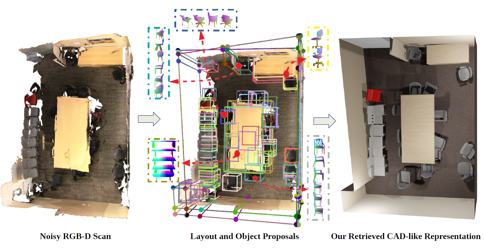
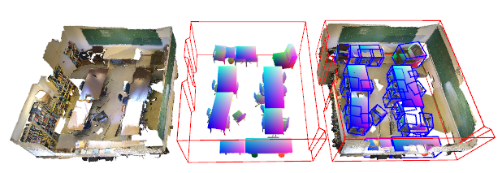

# Monte-Carlo Scene Search for 3D Scene Understanding (demo)

This repo contains visualization of the scene understanding results from [Monte-Carlo
Scene Search (MCSS)](https://arxiv.org/abs/2103.07969) method proposed in paper on the ScanNet dataset. MCSS esimates the scene
layout and retrieves object models and poses from an RGB-D scan of the scene.

<p align="center">
 
</p>

The MCSS method uses Monte-Carlo Tree Search (MCTS) to optimally select a set of
proposals from a pool of layout components and objects proposals to best explain
the RGB-D data. More specifically, we first generate multiple proposals for
each wall and object in the scene from the point-cloud data of the scene. We then adapt MCTS to optimally select a
set of wall and object proposals from this pool by relying on render and compare technique.
Our method retrieves finer details of complex scene layouts and retrieves objects
and their poses during cluttered scenarios. Our quantitative evaluation shows
that MCSS outperforms previous methods for layout estimation and object retrieval
tasks on the ScanNet dataset.

<p align="center">
 
</p>

In this repo, we provide scripts to visualize the results from our method.
We also provide evaluation scripts to reproduce the metrics reported in our
paper.

## Requirements
Clone the repo. Create and activate the virtual environment with python dependencies
```python
conda env create --file=environment.yml
conda activate mcss_demo
mkdir outputs
```

* Download the [ShapenetV2](https://shapenet.org/) dataset by signing up
on the website. Extract the models to `$SHAPENET_DIR`

* Download the [Scane2CAD](https://github.com/skanti/Scan2CAD) dataset by signing up
on there webpage. This is required ***only*** if you are running the eval scrips also.
Extract the zip file and let the path to *full_annotations.json* be `$SCAN2CAD`

* Download the MCSS results from [here](https://files.icg.tugraz.at/f/3ab82b7d215143cdb1f7/?dl=1
) and extract them to the `outputs`
folder.
Finally, your repo directory should contain the following folder structure:
```text
-MCSS_DEMO
    -assets
    -monte_carlo_model_search
    -outputs
        -scans
            -scene0011_00
            -scene0015_00
            .
            .
            

```
## Run Visualization
To visualize the outputs of MCSS on ScanNet random validation scenes, run the following
script:
```python
python demo.py --shapenet_dir $SHAPENET_DIR
```
The above script first downloads the ScanNet scene from the official ScanNet
server and then opens a open3d visualizer. Press 'q' to visualize a different scene.
If you want to visualize the a particular scene provide the scene ID as:
```python
python demo.py --shapenet_dir $SHAPENET_DIR --scene <sceneID>
```
Note that we provide MCSS results on only 126 and 64 validation scenes for evaluating objects and 
room layouts respectively (this is based on Scan2CAD and SceneCAD scenes whose scene IDs
end with '_00'). Further, our method considers 4 main categories of objects,
namely: chair, table, sofa and bed. Please read the paper for more details.
<p align="center">
 
</p>

## Run MCSS Evaluation for Objects 
We compare the accuracy of our method with a challenging baseline and other
methods that retrieve objects and estimate pose from an RGB-D scene. We
consider standard metrics for evaluation and provide scripts to replicate
the numbers reported on the paper. Please run the below script to obtain
average precision/recall and average chamfer distance for MCSS retrieved objects
on ScanNet 126 validation scenes. Again, these are the scenes whose scene IDs
end with '_00'. 

We evaluate the objects model retrieval and pose estimation accuracy by
comparing with [Scan2CAD](https://github.com/skanti/Scan2CAD) dataset which
contains manually annotated object models and poses for the ScanNet scenes.

```python
python eval.py --download_scenes
python eval.py --scan2cad $SCAN2CAD --shapenet_dir $SHAPENET_DIR
```
The first script downloads all the scannet scenes (takes a few mins).
The second script runs obtains the different metrics by comparing with Scan2CAD
annotations. The outputs are dumped in `outputs/evalAllScenesMCTS_testrun_0.500000IOU` folder.
The following files are important:
* catAP.json - Contains average precision for all categories
* catAR.json - Contains average recall for all categories
* mctsChamferDistCat.json - Contains chamfer distance (in mts) of the MCSS
retreived models for all categories
* s2cChamferDistCat.json - Contains chamfer distance (in mts) of the Scan2CAD
 annotation models for all categories
 
 ## Run MCSS Evaluation for Room Layouts 
We evaluate precision and recall of detected room corners and the IOU of the
detected room layout polygons. You can find our refined room layout annotations
[here](https://files.icg.tugraz.at/f/dbcbed1299e2415a9315/?dl=1) and extract
the results to `$LAYOUT_LABELS`. *.json files contain layout polygon instances. Every 
instance is a list of 3D polygon vertices. Then, you can run the evaluation using the 
following script:

```python
python eval.py --annotations_path $LAYOUT_LABELS --solutions_path outputs/scans/
```
